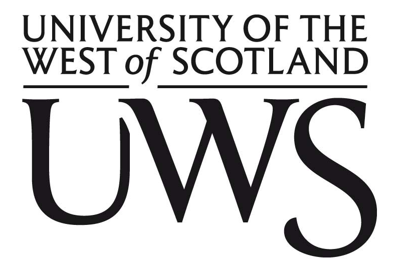

# UWS Volunteer Recognition Award

This is just the repository I used for my documents required for the volunteering module in my final year at the University of the West of Scotland. There are 3 documents in total that I hade to write to pass this module which were simply reviews of my tasks and duties as a Coding Mentor in Paisley and Linwood.

* Signoff Sheet
* Volunteer Report
* Activity Review

Upon submission I received the Volunteer Award with Leadership.
 
## Assignment

Requirements

## Submission

What was submitted

## License

Apache 2.0